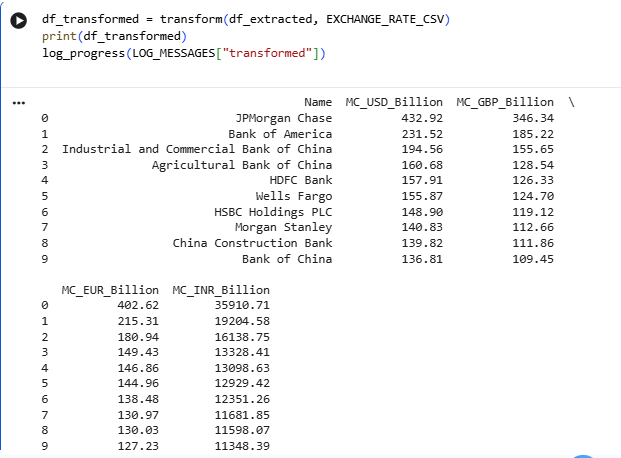
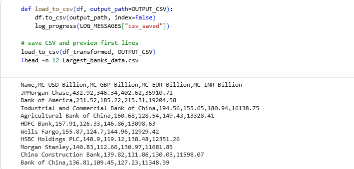
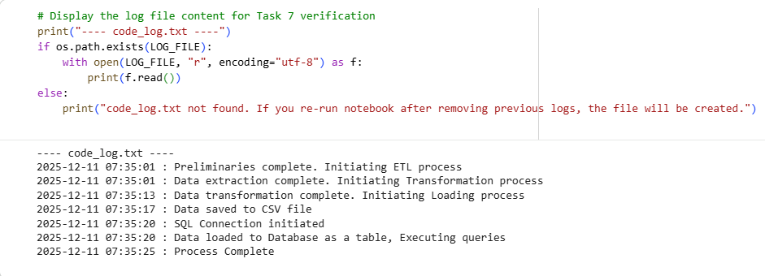

# ⚙️ ETL Pipeline: World’s Largest Banks Data Processing  
### 🎓 IBM Data Engineering Specialization – Portfolio Project

---

This project demonstrates a complete Extract, Transform, Load (ETL) workflow using Python. The goal is to extract the top 10 largest banks by market capitalization (USD), transform the data into GBP, EUR, and INR using the provided `exchange_rate.csv`, and load the processed data into both CSV and SQLite database formats. A detailed process log is also maintained throughout execution.

---

## 📑 Table of Contents
1. [Project Objectives](#-project-objectives)  
2. [Tools & Technologies Used](#-tools--technologies-used)  
3. [Libraries Used](#-libraries-used)
4. [Skills Demonstrated](#-skills-demonstrated)     
5. [How to Run the Project](#-how-to-run-the-project)  
6. [Results](#-results)  
7. [ETL Workflow](#-etl-workflow)
8. [About This Project](#-about-this-project)

---

## 🎯 Project Objectives
- Extract market capitalization data from an archived web source.  
- Clean and structure the raw data into a pandas DataFrame.  
- Convert USD market capitalization into GBP, EUR, and INR.  
- Save transformed data into a CSV file and SQLite database.  
- Log all major steps using a structured log file (`code_log.txt`).  
- Provide a clean, reproducible ETL workflow.
---

## 🛠️ Tools & Technologies Used
- ETL Process
- Google Colab  
- Python  
- SQLite  

---

## 📚 Libraries Used
- `requests`  
- `BeautifulSoup (bs4)`  
- `pandas`  
- `numpy`  
- `sqlite3`  
- `datetime`  

---

## 💡 Skills Demonstrated
- Web scraping using BeautifulSoup  
- Data cleaning and transformation with pandas  
- ETL workflow creation  
- SQL database loading and querying  
- Structured logging of workflow events  

---

## 🔄 ETL Workflow

### 1. Extract
- Scraped the “By market capitalization” table from the archived Wikipedia page.  
- Cleaned values and extracted the top 10 largest banks by USD market cap.

### 2. Transform
- Loaded exchange rates from `exchange_rate.csv`.  
- Calculated market capitalization in GBP, EUR, and INR.  
- Rounded transformed values to two decimal places.  
- Reordered DataFrame columns to match project requirements.

### 3. Load
- Saved the final DataFrame to `Largest_banks_data.csv`.  
- Loaded the processed data into `Banks.db` under the table name `Largest_banks`.

### 4. Logging
All major steps write timestamped entries into `code_log.txt` using:
YYYY-MM-DD HH:MM:SS : <message>

---

## ▶️ How to Run the Project
1. Open the notebook located at:  
Notebook/world_top_banks.ipynb
2. Run all cells in Google Colab or Jupyter Notebook.  
3. Ensure `exchange_rate.csv` is present in the Data directory.  
4. The output CSV, database, and logs will be recreated upon execution.

---

## 📊 Results

Below are the results showing each phase of the ETL workflow.  
All images are located in the `Results/` directory.

| 1. Extract Phase |
|--------------|
|  |
| Shows the successful extraction of the “By market capitalization” table and the top 10 banks selected from the webpage. |

---

| 2. Transform Phase |
|----------------|
|  |
| Displays the transformed DataFrame with GBP, EUR, and INR conversions applied to the USD market capitalization values. |

---

| 3. Save to CSV |
|-------------|
|  |
| Confirms that the final processed DataFrame was saved to `Largest_banks_data.csv`. |

---

| 4. SQL Query Results |
|------------------|
|  |
| Shows the SQL outputs for full table retrieval, average GBP market cap, and the top 5 bank names. |

---

| 5. Files Generated |
|----------------|
|  |
| Displays all generated output files, including the CSV, SQLite database, and related project artifacts. |

---

| 6. ETL Process Log |
|-----------------|
|  |
| Captures the contents of `code_log.txt`, showing timestamped logs for each stage of the ETL pipeline. |

---

## ℹ️ About This Project
- This ETL pipeline project is completed as part of the **IBM Data Engineering Specialization**.  
- The project has been structured, documented, and uploaded to GitHub as a portfolio project showcasing practical data engineering skills.
